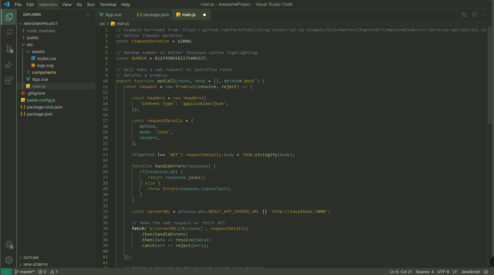

# Retro PC Green VS Code Theme

Retro PC Green is a dark theme for Visual Studio Code that brings a nostalgic retro PC feel to your coding environment. Inspired by vintage computer screens, this theme uses a soothing green text on a dark background, designed to reduce eye strain and provide a comfortable coding experience.

## Installation

1. **Download the Theme JSON File**:

   - Save the theme JSON content to a file named `retro-pc-green.json`.

2. **Install the Theme in VS Code**:
   - Open Visual Studio Code.
   - Go to the Command Palette (`Ctrl+Shift+P` or `Cmd+Shift+P` on Mac).
   - Select `Preferences: Open Settings (JSON)`.
   - Add the path to your `retro-pc-green.json` file under the `workbench.colorCustomizations` and `editor.tokenColorCustomizations` properties.

```json
"workbench.colorCustomizations": {
    // Add your custom theme path here
},
"editor.tokenColorCustomizations": {
    // Add your custom theme path here
}
```

3. **Reload VS Code**:
   - Reload or restart Visual Studio Code to apply the new theme.

## Screenshot



## Customization

Feel free to customize the theme to your liking. Open the `retro-pc-green.json` file and modify the color values as needed.

## Contributing

If you have suggestions for improvements or have found any issues, please open an issue or submit a pull request on the [GitHub repository](https://github.com/WuarTi/retro-green).

## License

This theme is licensed under the [MIT License](LICENSE).

---

Enjoy the Retro PC Green theme and happy coding!
